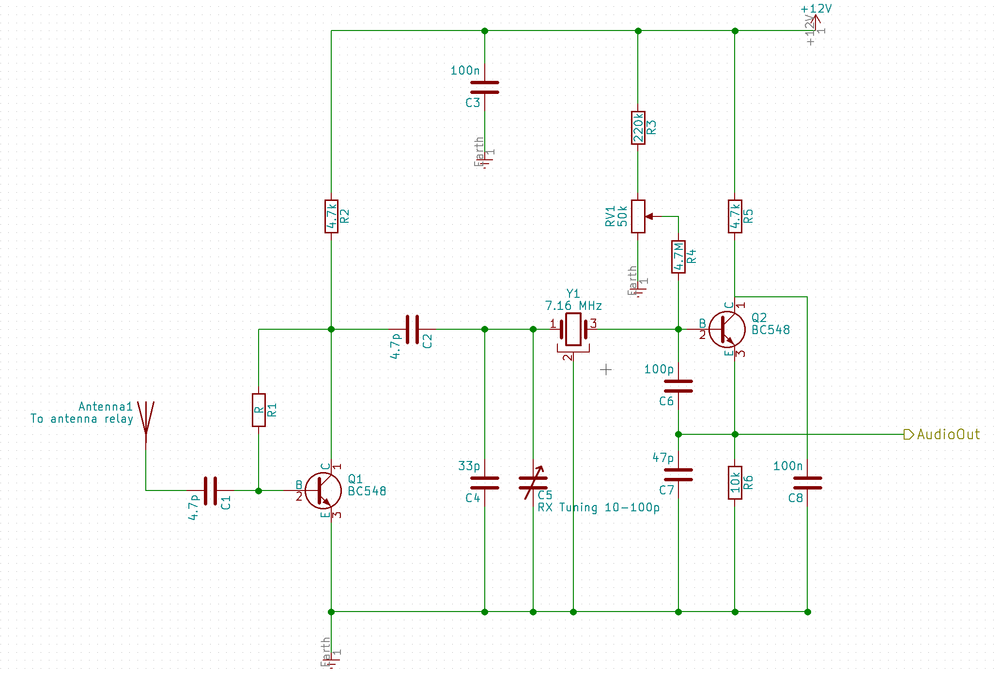

# 4030

4030 a simple 40m 30W CW TX/RX

Find kicad schematic in 4040 directory. It is a hierarchical set of sheets
corresponding to each system component.

# Resources

| Source            | Link                                                       |
| ---               | ---                                                        |
| F5LVG             | http://oernst.f5lvg.free.fr/rx/1v1-2010/RX-1V1English.html |
| Peter Paker VK3YE | AR Vol 85/8 p6                                             |
